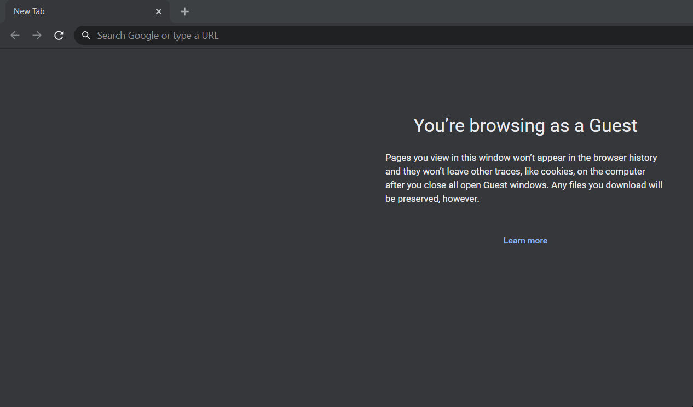

# fiori-tools

Library of extensions for [SAP Fiori Tools](https://www.npmjs.com/package/@sap/ux-ui5-tooling) ( @sap/ux-ui5-tooling )

UI5 cli makes it possible to develop and test apps on your local machine. Fiori tools is a set of server middleware which delivers even greater experience.

This package brings features on top of functions developed by SAP

- List of middlewares
  * [fiori-tools-home-page: Redirect to a home page](#fiori-tools-home-page-redirect-to-a-home-page)
  * [fiori-tools-proxy-cdn: bootstrap SAPUI5 from CDN](#fiori-tools-proxy-cdn-bootstrap-sapui5-from-cdn)
  * [fiori-tools-neo-app: support neo-app.json for existing applications](#fiori-tools-neo-app-support-neo-appjson-for-existing-applications)

## How to install

Install the module

```bash
npm install fiori-tools @sap/ux-ui5-tooling
```

add the following section to you package.json file

```json
"ui5": {
    "dependencies": [
      "@sap/ux-ui5-tooling",
      "fiori-tools"
    ]
```

This module can be used indepentently from @sap/ux-ui5-tooling also but it's not a target use case.

## fiori-tools-home-page: Redirect to a home page

**What**: a very simple feature - redirection to a default page from the empty path



**Why**: in the template provided by Fiori Tools application generator we can see test/flpSandbox.html and test/flpSandboxMockServer.html files. Besides of that  we have also sandbox launchpad available as a part of UI5  library and we can take it directly from the test resources. [Fiori Launchpad - Sandbox for application development](https://ui5.sap.com/test-resources/sap/ushell/shells/sandbox/fioriSandbox.html#Shell-home)

In addition, sandbox launchpad delivers really nice feature to maintain application config as a separate json file which creates even a space to generate it via API.

**How to use**: just declare it like this

```yaml
server:
  customMiddleware:
    - name: fiori-tools-home-page
      beforeMiddleware: serveIndex
      configuration:
         home_page: "/test-resources/sap/ushell/shells/sandbox/fioriSandbox.html"
```

it is important to remember that /test-reources is supposed to be published like this:

```yaml
server:
  customMiddleware:
    - name: fiori-tools-proxy
      beforeMiddleware: compression
      configuration:    
        ui5:
          path:
            - /resources
            - /test-resources
        url: https://sapui5.hana.ondemand.com
        version: 1.78.0
```

## fiori-tools-proxy-cdn: bootstrap SAPUI5 from CDN

**What**: this concept is described in [SAPUI5 SDK - Demo Kit](https://ui5.sap.com/#/topic/2d3eb2f322ea4a82983c1c62a33ec4ae). The idea is simple - we use an absolute URL in bootstrap script instead of the relative one.  This extension transforms the original page like this

```html
<script id="sap-ushell-bootstrap" src="../../bootstrap/sandbox.js"></script>

        <script id="sap-ui-bootstrap"
            src="../../../../../resources/sap-ui-core.js"
            data-sap-ui-evt-oninit="main();"
            data-sap-ui-libs="sap.m"
            data-sap-ui-async="true"
            data-sap-ui-theme="sap_fiori_3"
            data-sap-ui-compatVersion="1.16"
            data-sap-ui-xx-bindingSyntax="complex">
        </script>

        <script src="../../bootstrap/standalone.js"></script>
```

into properly resolved page like that

```html
 <script id="sap-ushell-bootstrap" src="https://sapui5.hana.ondemand.com/1.78.0/test-resources/sap/ushell/bootstrap/sandbox.js"></script>

        <script id="sap-ui-bootstrap"
  src="https://sapui5.hana.ondemand.com/1.78.0/resources/sap-ui-core.js"
  data-sap-ui-evt-oninit="main();"
  data-sap-ui-libs="sap.m"
  data-sap-ui-theme="sap_fiori_3"
  data-sap-ui-compatversion="1.16"
  data-sap-ui-xx-bindingsyntax="complex">
        </script>

        <script src="https://sapui5.hana.ondemand.com/1.78.0/test-resources/sap/ushell/bootstrap/standalone.js"></script>
```

**Why**: basically the main reason for that is performance. In case if you are not UI5 library developer then you probably don't need even to send these requests for /resources and /test-resources to your local machine and then to resend them to the internet. In debug mode Fiori application can easily send around 1K files reading sources 1 by 1 so why you should load your PC if your browser can do this directly. Another reason is caching - by using  an absolute path it doesn't matter on which local port your service is running - those files will be always cached within a specific UI5 version.

**How to use:** 

You can notice again that this middleware is supposed to work together with fiori-tools-proxy. In fact it's created to make life of a main proxy middleware much simpler and to send less traffic on it

```yaml
server:
  customMiddleware:
    - name: fiori-tools-proxy-cdn
      beforeMiddleware: fiori-tools-proxy
      configuration:
        fiori_tools_proxy: 
          ui5:
            url: https://sapui5.hana.ondemand.com
            version: 1.78.0
        home_page: "/test-resources/sap/ushell/shells/sandbox/fioriSandbox.html"
```

you may notice that it uses the same configuration as the original middleware fiori-tools-proxy. Therefore if we want to use all of them we can use yaml merge feature to make file more compact:

```yaml
customConfiguration: &global
  fiori_tools_proxy: &fiori-tools-proxy
    ui5:
      path:
        - /resources
        - /test-resources
      url: https://sapui5.hana.ondemand.com
      version: 1.78.0
  home_page: "/test-resources/sap/ushell/shells/sandbox/fioriSandbox.html"
server:
  customMiddleware:
    - name: fiori-tools-proxy
      beforeMiddleware: compression
      configuration:
        <<: *fiori-tools-proxy
    - name: fiori-tools-proxy-cdn
      beforeMiddleware: fiori-tools-proxy
      configuration:
        <<: *global
    - name: fiori-tools-home-page
      beforeMiddleware: serveIndex
      configuration:
        <<: *global
```

## fiori-tools-neo-app: support neo-app.json for existing applications

**What**: this middleware support neo-app.json file for ui5 apps launched with ui5 serve/fiori run. New middleware fiori-tools-proxy has a backend configuration however for some projects there might be too much rules. Also it requires separate backend host definition for each of rules while neo-app.json supports destinations.

**How to use**:

declare middleware in ui5.yaml

```yaml
server:
  customMiddleware:
    - name: fiori-tools-neo-app
      afterMiddleware: fiori-tools-proxy        
```

provide neo-app.json in the project root folder

```json
{
  "routes": [
    {
      "path": "/odata/northwind",
      "target": {
        "type": "destination",
        "name": "northwind",
        "entryPath": "/V2/Northwind/Northwind.svc"
      },
      "description": "Odata:dev"
    }
  ]
}
```

provide neo-dest.json file with configuration like this

```json
{ "northwind": { "target": "https://services.odata.org" } }
```

start the server and check how it works

```bash
 curl localhost:8080/odata/northwind/Regions
```


## appconfig/fioriSandboxConfig.json

All modules of this project are actually built around page /test-resources/sap/ushell/shells/sandbox/fioriSandbox.html. This is just a simple Fiori launchpad page which uses /appconfig/fioriSandboxConfig.json as configuration file

By default we have a page like this:


But adding a file like this:

```json
{
  "applications": {
    "GL-lineItems": {
      "title": "G/L items report"
    }
  },
  "services": {
    "LaunchPage": {
      "adapter": {
        "config": {
          "groups": []
        }
      }
    },
    "NavTargetResolution": {
      "adapter": {
        "config": {
          "applications": {
            "GL-lineItems": {
              "additionalInformation": "SAPUI5.Component=fin.gl.glview.display.FIN_GL_LITB_GLVExtension",
              "url": "/"
            }
          }
        }
      }
    }
  }
}


```

we have a page like this:


With this config we can also test cross-app navigations.
